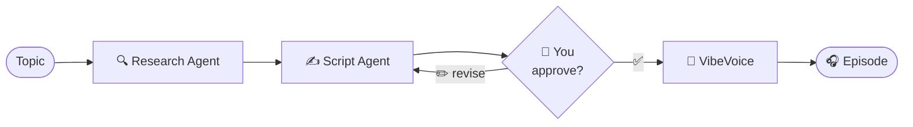

# 🎙️ AI Podcast Workshop

### Build *Future Bytes* with a team of AI agents

<div class="pt-12">
  <span class="px-2 py-1 rounded bg-white bg-opacity-10">
    Press <kbd>Space</kbd> to start →
  </span>
</div>

<div class="abs-br m-6 text-sm opacity-60">
  Based on <code>edgeai-for-beginners / WorkshopForAgentic</code>
</div>

---
layout: center
class: text-center
---

# Today's mission

You and your friends want to launch a tech podcast.<br>
Everyone's busy. Nobody wants to write scripts at 2am.

<v-click>

### Solution: hire AI agents to do it for you.

</v-click>

<v-click>

One researches. One writes. One *performs* the script.<br>
**You** stay creative director.

</v-click>

---

# What we'll actually do today

<v-clicks>

- 🧠 **Prompt** an AI agent into being a podcast scriptwriter
- 🎭 **Design characters** — hosts with distinct voices and POV
- 🔄 **Orchestrate** a research → script → review pipeline
- 🎤 **Generate audio** with multi-speaker TTS (VibeVoice)
- 🚀 **Ship** a real episode of *Future Bytes*

</v-clicks>

<v-click>

<div class="mt-8 p-4 rounded border border-teal-400 border-opacity-50 bg-teal-400 bg-opacity-5">
  Today is about <b>creative prompting workflows</b> — the artifacts (scripts, characters, banter)
  are the point. The infra is just there to serve the story.
</div>

</v-click>

---
layout: two-cols
---

# About your environment

We're skipping the install pain.

<v-clicks>

- ✅ Pre-built **dev container** — Ollama + models + framework already wired up
- ✅ **Qwen-3-8B** pre-pulled, ready for inference
- ✅ Microsoft Agent Framework + VibeVoice deps installed
- ✅ Notebooks open and runnable on click

</v-clicks>

::right::

<div class="pl-6">

### Why a dev container?

<v-clicks>

- Pulling a 5GB model over conference Wi-Fi = 😬
- Local Python/CUDA conflicts eat the first hour
- Everyone gets the **same** working baseline
- Your laptop stays cool

</v-clicks>

<v-click>

<div class="mt-6 text-sm opacity-70">
You can absolutely run this locally later — the
<code>WorkshopForAgentic/README.md</code> has full setup steps.
</div>

</v-click>

</div>

---
layout: section
---

# Quick context: Edge AI

Why is this workshop *built* on an Edge AI curriculum?

---

# Edge AI in one slide

**Edge AI** = running models on the device that generated the data.<br>
No cloud round-trip. No API bill. No data leaving your machine.

<v-clicks>

- 🔒 **Privacy** — your script ideas don't get logged by a vendor
- ⚡ **Latency** — milliseconds, not seconds
- 💸 **Cost** — $0 per token, forever
- 📡 **Resilience** — works on a plane, in a basement, on bad Wi-Fi
- 📜 **Compliance** — data sovereignty by default

</v-clicks>

<v-click>

> Today's whole stack — **Qwen-3-8B in Ollama on your laptop** — *is* edge AI in practice.

</v-click>

---

# What you'd learn from the full curriculum

The repo we're using has **8 modules** beyond today's workshop. We won't cover them, but here's what's in them — explore on your own time.

<div class="grid grid-cols-2 gap-x-8 gap-y-3 text-sm pt-2">

<div v-click>

**Module 01 — Edge AI Fundamentals**
Why edge, where it's deployed, real cases
</div>

<div v-click>

**Module 02 — The SLM Family Tree**
Phi, Qwen, Gemma, BitNet, Phi Silica
</div>

<div v-click>

**Module 03 — Deploying SLMs**
Local + cloud deployment patterns
</div>

<div v-click>

**Module 04 — Optimization Toolchains**
llama.cpp, Olive, OpenVINO, MLX, QNN
</div>

<div v-click>

**Module 05 — SLMOps**
Distillation, fine-tuning, deployment lifecycle
</div>

<div v-click>

**Module 06 — Agents & MCP**
Function calling, tools, Model Context Protocol
</div>

<div v-click>

**Module 07 — Windows Edge AI**
AI Toolkit, Foundry Local, Windows dev story
</div>

<div v-click>

**Module 08 — Foundry Local**
Hybrid local + Azure AI Foundry workflows
</div>

</div>

<div v-click class="mt-4 text-xs opacity-70">
Repo: <code>github.com/microsoft/edgeai-for-beginners</code>
</div>

---

# Key takeaways (if you do explore)

<v-clicks>

- **Smaller models are catching up fast.** A 3B–8B model on your laptop today does what a 70B model did 18 months ago.
- **Quantization is the unlock.** 4-bit and even 1.58-bit (BitNet) make 7B+ models fit in laptop RAM.
- **Hardware matters.** CPU works, GPU is faster, NPUs (Phi Silica, Qualcomm QNN, Apple Neural Engine) change the game for battery life.
- **Hybrid is the real pattern.** Edge for latency/privacy, cloud for the heavy lift — Foundry Local makes this seamless.
- **Agents + tools > bigger models.** A small model with the right tools beats a huge model with none.

</v-clicks>

---
layout: section
---

# OK — back to the podcast.

Three acts. Each one is mostly **prompting**.

---

# The creative pipeline

<div class="grid grid-cols-3 gap-4 pt-4">

<div class="p-4 rounded border border-blue-400 border-opacity-40">

### Act 1 🤖
**Meet Alex**

A single agent. Your scriptwriter.<br>
Prompt it into being.

</div>

<div class="p-4 rounded border border-purple-400 border-opacity-40">

### Act 2 🎬
**The Crew**

Research agent + Script agent + you as approver.<br>
A workflow.

</div>

<div class="p-4 rounded border border-pink-400 border-opacity-40">

### Act 3 🎤
**The Voices**

Script → multi-speaker audio.<br>
A real episode.

</div>

</div>

<v-click>

<div class="mt-8 text-center opacity-80">
Notice: the <i>artifact</i> at each step is text we've prompted into existence. The model is just the engine.
</div>

</v-click>

---
layout: section
---

# Act 1 — Meet Alex

Your first AI scriptwriter

---

# What's an SLM and why does Alex use one?

<v-clicks>

- **Small Language Model** — 1B to 10B parameters, vs 100B+ for the big guys
- Today: **Qwen-3-8B**, running locally via Ollama
- Fast enough for interactive prompting
- Small enough to fit on your laptop
- Smart enough to write a podcast script

</v-clicks>

<v-click>

```python
from agent_framework import ChatAgent
from agent_framework.ollama import OllamaChatClient

alex = ChatAgent(
    chat_client=OllamaChatClient(model="qwen3:8b"),
    instructions="You are Alex, a podcast scriptwriter for 'Future Bytes'.",
)
```

</v-click>

---

# Prompting Alex into character

A model becomes a *character* through its system prompt. This is the workshop.

```text {1|2-4|5-7|8-10|all}
You are Alex, head writer for the "Future Bytes" tech podcast.

Your hosts are Maya (curious skeptic, asks "but why?") and
Rio (hype-friendly engineer, loves a metaphor). They banter.

Style rules:
- 2 to 4 sentences per turn, then hand off
- Open with a hook, never with "Welcome to the show"
- One concrete example per claim, no buzzword soup

When given a topic, output a script as:
Maya: ...
Rio: ...
```

<v-click>

<div class="mt-4 text-sm opacity-70">
Try it: change Maya from "skeptic" to "stand-up comedian." Watch the whole tone shift.
</div>

</v-click>

---

# Mission 1 — your first script

📓 `code/01.BasicAgent/00.BasicAgent-agent.ipynb`

<v-clicks>

1. Open the notebook in the dev container
2. Edit the system prompt — give Alex a personality
3. Pick a topic ("AI breakthroughs this year")
4. Generate a 2-minute script
5. **Read it out loud.** Where does it sound robotic? Edit the prompt, re-run.

</v-clicks>

<v-click>

<div class="mt-6 p-3 rounded bg-yellow-400 bg-opacity-10 border border-yellow-400 border-opacity-40">
  <b>Creative challenge:</b> get Alex to land a joke. (Harder than it sounds.)
</div>

</v-click>

---

# Mission 2 — give Alex tools

Alex is smart but stuck inside its head. **Tools** let it reach out.

```python
def get_trending_topics(category: str) -> list[str]:
    """Return today's trending topics in a category."""
    ...

def search_arxiv(query: str) -> list[dict]:
    """Search recent AI research papers."""
    ...

alex = ChatAgent(
    chat_client=OllamaChatClient(model="qwen3:8b"),
    instructions=SYSTEM_PROMPT,
    tools=[get_trending_topics, search_arxiv],
)
```

<v-click>

The model decides *when* to call each tool. You don't write the orchestration — the prompt + tool docstrings do.

</v-click>

---

# Mission 3 — make Alex think out loud

Reasoning mode = "show your work."

<v-clicks>

- Useful when the model goes off the rails — you can see *where*
- Better for tricky decisions ("which guest fits this topic?")
- Trade-off: slower, more tokens

</v-clicks>

<v-click>

```text
<thinking>
The topic is on-device LLMs. Maya should push on the "but is it
actually usable?" angle — that's her brand. Rio can flex with
specific numbers (8GB RAM, ~30 tok/s on M-series).
</thinking>

Maya: OK Rio, sell me on this. Why would I run AI on my laptop...
```

</v-click>

---
layout: section
---

# Act 2 — The Production Crew

One agent is a soloist. A workflow is a band.

---

# Why orchestrate at all?

<div class="grid grid-cols-2 gap-8 pt-2">

<div>

### One agent, all jobs 🥵
<v-clicks>

- Prompt becomes a 2000-word monolith
- Mixes "research" voice with "writer" voice
- Hard to debug — which step broke?
- One change ripples through everything

</v-clicks>

</div>

<div>

### Specialized crew 🎭
<v-clicks>

- Each agent has **one** job, one prompt
- Test/iterate each independently
- Swap a member without rewriting the rest
- Humans approve at the seams

</v-clicks>

</div>

</div>

---

# The "Future Bytes" workflow



<v-clicks>

- **Research Agent**: prompted to gather facts, cite sources, stay neutral
- **Script Agent**: prompted to be a *writer*, not a researcher — turns facts into banter
- **You**: the human-in-the-loop. Approve or send back with notes.
- **VibeVoice**: not an agent — a tool the workflow calls

</v-clicks>

---

# The hand-off prompts (this is the real magic)

<div class="grid grid-cols-2 gap-4 text-xs">

<div>

**Research Agent system prompt**
```text
You research tech topics for a podcast.

Output: 5-8 bullet points.
Each must include:
- The fact
- A source URL or citation
- Why a curious non-expert
  would find it interesting

Do NOT write dialogue.
Do NOT add opinions.
The script writer handles that.
```

</div>

<div>

**Script Agent system prompt**
```text
You write podcast scripts. You receive
research bullets and turn them into
banter between Maya and Rio.

Rules:
- Use AT LEAST 4 of the bullets
- Maya opens with a hook
- One callback joke per script
- End on a question for next episode

Do NOT add facts not in the research.
If something's missing, ask.
```

</div>

</div>

<v-click>

<div class="mt-4 text-center opacity-80">
The handoff is the contract. Each agent's prompt is shaped by the <i>shape of the input</i> it'll receive.
</div>

</v-click>

---

# Mission — run the crew

📓 `code/02.Workflow-MultiAgent/`

<v-clicks>

1. Run the workflow with a topic of your choice
2. Read the research output **before** the script — does it make sense?
3. Read the script — what did the Script Agent **add** that wasn't in research?
4. Send a revision back: "make Rio more skeptical"
5. Watch how that ripples

</v-clicks>

<v-click>

<div class="mt-6 p-3 rounded bg-purple-400 bg-opacity-10 border border-purple-400 border-opacity-40">
  <b>Stretch goal:</b> add a third agent — a "fact-checker" between research and script.
  What's its prompt? What's its handoff format?
</div>

</v-click>

---
layout: section
---

# Act 3 — Bring it to life

Text → audio that doesn't sound like a GPS

---

# VibeVoice in 30 seconds

Microsoft Research's open-source TTS, built for **podcast-style** audio.

<v-clicks>

- 🎭 Up to **4 distinct speakers** with consistent voices
- ⏱️ Up to **90 minutes** of continuous audio per pass
- 🎵 Natural turn-taking, pauses, prosody
- ⚡ 7.5 Hz frame rate — efficient enough to run locally
- 🧠 LLM-conditioned diffusion → understands context, not just phonemes

</v-clicks>

<v-click>

<div class="mt-4 text-sm opacity-70">
Why it matters for us: the <i>script format</i> we've been generating all day is exactly its input format.
</div>

</v-click>

---

# Format your script for VibeVoice

```text
Speaker 1: Hey Rio — pop quiz. What's running on my laptop right now?
Speaker 2: Uh... Slack? Forty-seven Chrome tabs? An ill-advised
           Spotify playlist?
Speaker 1: Close. An eight-billion-parameter language model.
Speaker 2: Wait, locally? On battery?
Speaker 1: That's the whole point of today's episode.
```

<v-clicks>

- **Same artifact** the Script Agent produces — no transformation needed
- Speaker labels map to voice profiles
- Punctuation drives prosody — use it deliberately
- Em-dashes and ellipses → natural pauses

</v-clicks>

---

# Mission — ship the episode

📓 `code/03.GenerationAudio/`

<v-clicks>

1. Take your favorite script from Act 2
2. Run `./run_vibe_voice.sh`
3. Listen with headphones (seriously, the difference is huge)
4. **Where does it break?** Note the exact line.
5. Edit the *script* (not the model) and re-run

</v-clicks>

<v-click>

<div class="mt-6 text-sm opacity-70">
The fix is almost always in the script: a comma, a sentence break, a clearer speaker handoff.
This is where prompting and writing become the same skill.
</div>

</v-click>

---

# ⚠️ Use this responsibly

<v-clicks>

- VibeVoice can clone voices. **Get consent.**
- No deepfakes. No impersonation.
- Disclose AI-generated audio when you publish.
- The Microsoft Research model card spells out the rules — read it.

</v-clicks>

---
layout: section
---

# Wrap-up

What you built. Where to go next.

---

# What you actually built today

<v-clicks>

- A **scriptwriter** prompted into a specific voice
- A **multi-agent pipeline** with handoff contracts you designed
- A **human approval gate** — you stayed creative director
- A **real audio episode** from script to MP3
- All running **locally**, on edge AI

</v-clicks>

<v-click>

<div class="mt-6 text-center text-lg">
The model didn't make your podcast. <b>Your prompts did.</b>
</div>

</v-click>

---

# Going further on your own

<div class="grid grid-cols-2 gap-6">

<div>

### The Edge AI side
<v-clicks>

- 📘 `edgeai-for-beginners/` — full 8 modules
- 🧠 Module 02 — pick a different SLM, swap it in
- 🛠️ Module 04 — quantize a model with Olive or llama.cpp
- 🎓 Module 05 — fine-tune on your podcast's vibe
- 🪟 Module 07 — try Foundry Local on Windows

</v-clicks>

</div>

<div>

### The creative side
<v-clicks>

- 🎙️ Add a third host
- 🌍 Translate scripts before TTS
- 🎵 Add a "music director" agent
- 📰 Wire up an RSS-fed research agent
- 🤝 Hand the workflow to a friend — does it produce *their* voice?

</v-clicks>

</div>

</div>

---
layout: center
class: text-center
---

# Thanks 💜

### Now go make *Future Bytes* real.

<div class="pt-8 text-sm opacity-70">
Repo: <code>github.com/microsoft/edgeai-for-beginners</code><br>
Workshop module: <code>WorkshopForAgentic/</code>
</div>

<div class="abs-br m-6 text-xs opacity-50">
Press <kbd>o</kbd> for slide overview &middot; <kbd>d</kbd> to toggle dark mode
</div>
